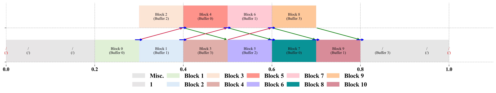
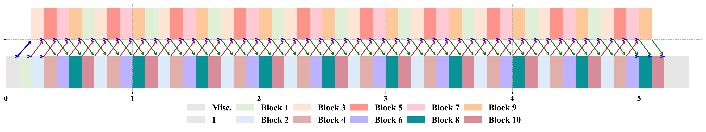
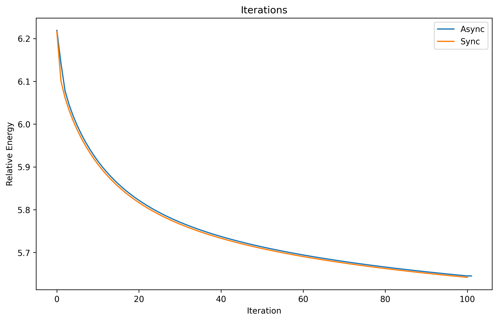

# HeteroScheduler

The source code of **SIGGRAPH 2025** paper **Auto Task Scheduling for Cloth and Deformable Simulation on Heterogeneous Environments** ([Chengzhu He](https://chengzhuuwu.github.io/), [Zhendong Wang](https://wangzhendong619.github.io/), Zhaorui Meng, [Junfeng Yao](https://cdmc.xmu.edu.cn/), [Shihui Guo](https://www.humanplus.xyz/), [Huamin Wang](https://wanghmin.github.io/)).

We provided several examples to show our scheduler and asynchronous iteration progress.

## Example 1: Simplist HEFT case

This example shows how HEFT algorithm makes scheduling, we use the original case given by the paper "Performance-effective and low-complexity task scheduling for heterogeneous computing" (IEEE Transaction on Parallel and Distributed System 2002, H. Topcuoglu et. al.).

Given the DAG (represent the relationship between tasks) and the computation matrix of each task on each devices, how do we make schedling that allocated each tasks into devices?

HEFT algorithm will quantify the dependency of each task ($rank_u$) and sorted them. Based on the sorted task list, the scheduler then allocated each tasks into the devices with the ealiest-finish-time (EFT). The scheduling result should be (a) in the following figure (figure (b) is scheduled based on another scheduling algorithm "CPOP"): 

The final time (represented the finished time of the latest task across all devices, $n_{10}$) should be 91.

> Speedup to proc 0 = 39.56% (From 127.00 to 91.00 ) 
> Speedup to proc 1 = 42.86% (From 130.00 to 91.00 ) 
> Speedup to proc 2 = 57.14% (From 143.00 to 91.00 )

Our HEFT implementation is based on a [python-version heft](https://github.com/mackncheesiest/heft), which is the source code of paper "Performant, Multi-Objective Scheduling of Highly Interleaved Task Graphs on Heterogeneous System on Chip Devices" (IEEE Transactions on Parallel and Distributed Systems 2022, [Joshua Mack](https://github.com/mackncheesiest/) et. al.).

## Example 2: Asychronous iteration on VBD

This example shows the difference between the original iteration pipeline and our asynchronous iteration pileline. Considering we have allocated iteration tasks (different colors) into 2 devices, then how do we make data transfering? 

This example only considering the simplist case: costs of tasks is a constant value $t_c$ and the comminication delay is exactly the same value $t_c$, then we make make the data transfering as follows:

If we considering the overlapping across iterations (such as 10 iterations):

> Figures that visualizing the scheduling reult is generated by "documents/example2_scheduling_result.py".

We use mass-spring streching and quadratic bending model, this can also extended to other linear or non-linear energy model. VBD (Vertex Block Descent) is a SIGGRAPH 2024 paper. 

The convergent rate between sync-based simulation and async-based simulation is nearly the same (in some cases, async-based will convergent faster, especially considering collision energy). However, we will get about 90% speedup compared to single device implementation (From 10.30ms to 5.40ms):

> Figures that visualizing the convergence rate of async-based and sync-based simulation (the 10th frame convergence result with 100 iterations each frame, timestep h=1/60s) is generated by "documents/example2_async_convergence.py".

## Example 3: Asychronous iteration with CPU-GPU implementation

This example shows how do we use our heterogenous framework in a simulation application. After we register the implementation and specify DAG, the our scheduler will automatically make scheuling including: calculating the communication matrix, allocating the tasks into devices, specifying the data tranfers, and update communication matrix each frame.

We use Metal-shading-language for GPU implementation, so this example is only supported on MacOS.

Coding will be comming soon...

<!-- Most of the code is tested, except for `LaunchModeHetero`, we are working hard to fix the inequal result compared to sequecial implementation.

We make scheduling each frame to fit the dynamic overhead caused by collisions (Although we do not add collision in this example... might comming soooooon)  -->

## Dependencies

The library itself depends only on glm and TBB. For windows users, TBB installed by vcpkg might be hard to debug, so we use the source code to compile. Example 3 can only run on MacOS due to our Metal based GPU implementation.

## Others

If you have any questions on our methods or our source code, please feel free to [contact me](https://chengzhuuwu.github.io/) **at any time**!!!