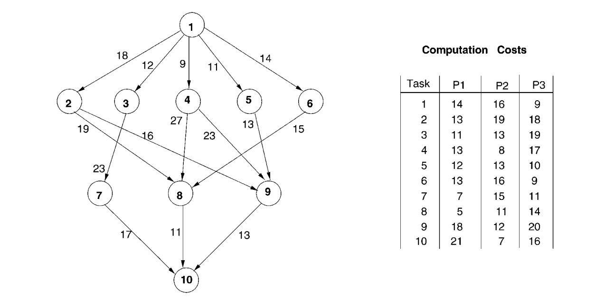
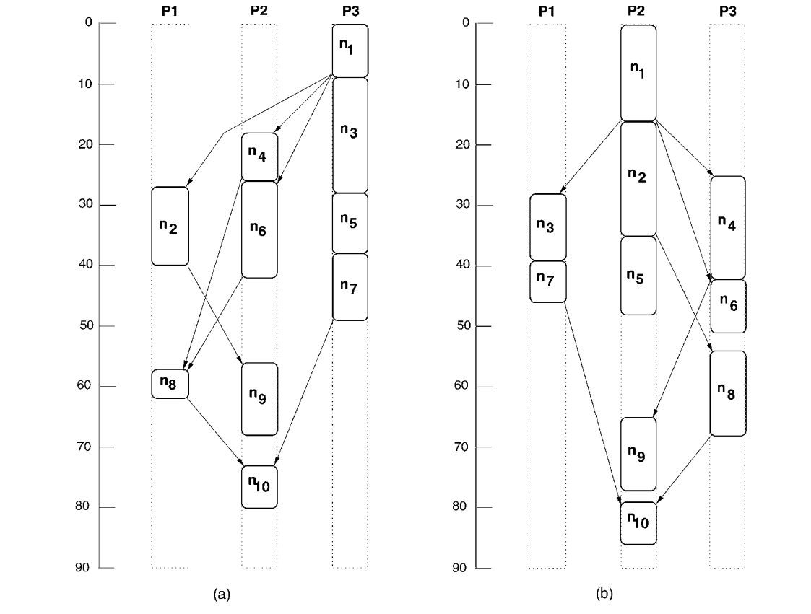
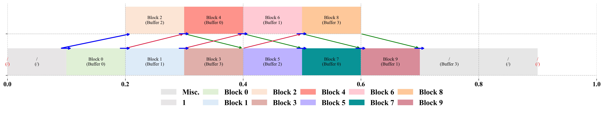
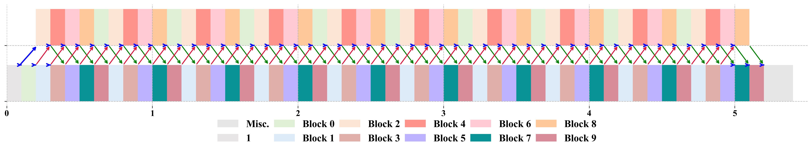
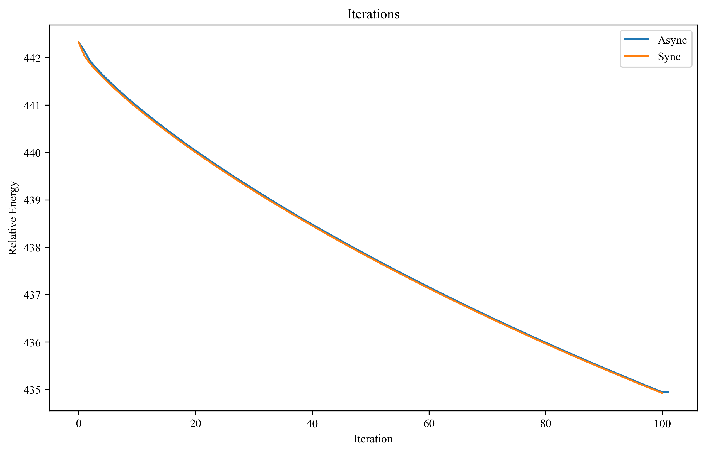
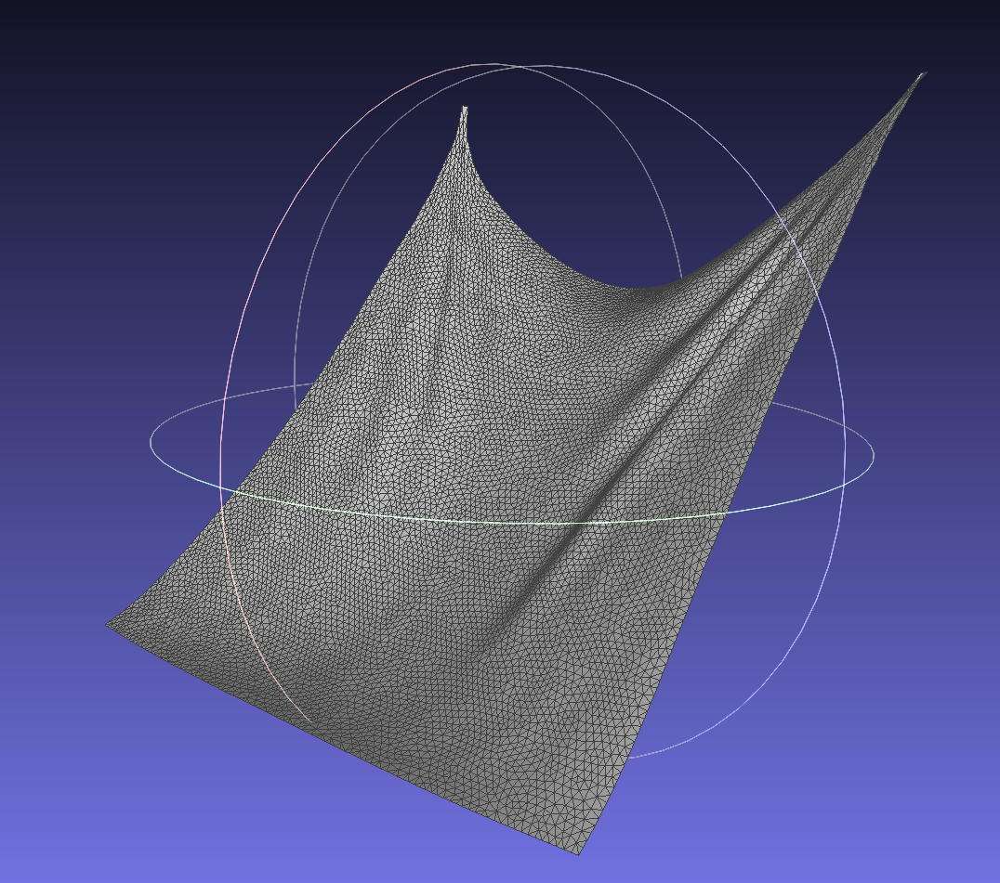
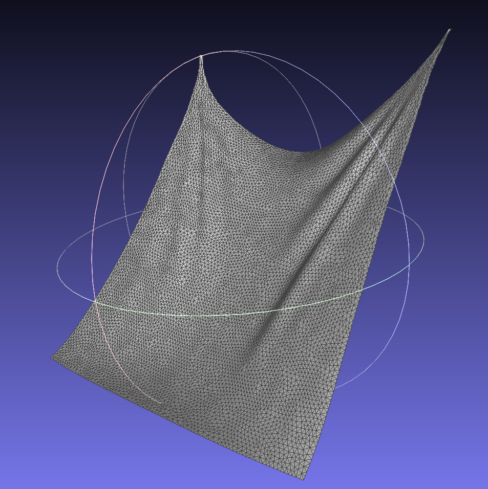
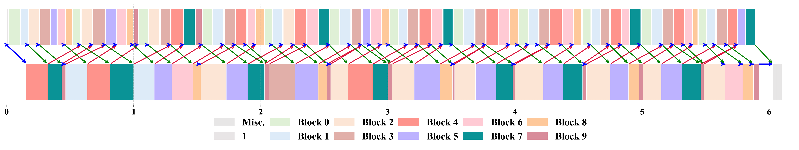

# libAtsSim

Code for SIGGRAPH 2025 conference paper "Auto Task Scheduling for Cloth and Deformable Simulation on Heterogeneous Environments".

Authors: [Chengzhu He](https://chengzhuuwu.github.io/), [Zhendong Wang](https://wangzhendong619.github.io/), Zhaorui Meng, [Junfeng Yao](https://cdmc.xmu.edu.cn/), [Shihui Guo](https://www.humanplus.xyz/), [Huamin Wang](https://wanghmin.github.io/).

<!-- [Download Paper](https://chengzhuuwu.github.io/files/ats_camera_ready.pdf) -->

<!-- <video src="movie.mp4.mp4" controls="controls" width="500" height="300"></video> -->

We provided several examples to show our scheduler and asynchronous iteration progress.

## Example 1: Simplist HEFT case

This example shows how HEFT algorithm makes scheduling, we use the original case given by the paper ["Performance-effective and low-complexity task scheduling for heterogeneous computing"](https://ieeexplore.ieee.org/document/993206) (IEEE TPDS 2002, H. Topcuoglu et. al.).

Given the DAG (represent the relationship between tasks) and the computation matrix of each task on each devices, how do we make schedling that allocated each tasks into devices?



HEFT algorithm will quantify the dependency of each task ($rank_u$) and sorted them. Based on the sorted task list, the scheduler then allocated each tasks into the devices with the ealiest-finish-time (EFT). The scheduling result should be (a) in the following figure (figure (b) is scheduled based on another scheduling algorithm "CPOP"): 



The final time (represented the finished time of the latest task across all devices, $n_{10}$) should be 91.

> Speedup to proc 0 = 39.56% (From 127.00 to 91.00 ) 
>
> Speedup to proc 1 = 42.86% (From 130.00 to 91.00 ) 
>
> Speedup to proc 2 = 57.14% (From 143.00 to 91.00 )

Our HEFT implementation is based on a [python-version heft](https://github.com/mackncheesiest/heft), which is the source code of paper ["Performant, Multi-Objective Scheduling of Highly Interleaved Task Graphs on Heterogeneous System on Chip Devices"](https://ieeexplore.ieee.org/document/9653796) (IEEE TPDS 2022, [Joshua Mack](https://github.com/mackncheesiest/) et. al.).

## Example 2: Asychronous iteration on VBD

This example shows the difference between the original iteration pipeline and our asynchronous iteration pileline. Considering we have allocated iteration tasks (different clusters in [Vertex Block Descent](https://ankachan.github.io/Projects/VertexBlockDescent/index.html), SIGGRAPH 2024, Anka He Chen et. al.) into 2 devices, then how do we make data transfering? 

This example only considering the simplist case: costs of tasks is a constant value $t_c$ and the comminication delay is exactly the same value $t_c$, then we make make the data transfering as follows:



> Different lines means different devices. Here the upper line refers to tasks on GPU and the lower line refers to CPU.

If we considering the overlapping across iterations (such as 10 iterations):



> Figures that visualizing the scheduling reult is generated by "documents/example2_scheduling_result.py".

We use mass-spring streching and quadratic bending model, this can also extended to other linear or non-linear energy model.

The convergent rate between sync-based simulation and async-based simulation is nearly the same (in some cases, async-based will convergent faster, especially considering collision energy). However, we will get about 90% speedup compared to single device implementation (From 10.30ms to 5.40ms):



> Figures that visualizing the convergence rate of async-based and sync-based simulation (the 30 th frame convergence result with 100 iterations each frame, timestep h=1/60s) is generated by "documents/example2_async_convergence.py".

The simulation result in the 30th frame:

| Async_Result | Sync_Result |
|--------------|-------------|
|  |  |

Note that:

- In this paper, we summarize the potential communication scenarios between devices. In practice, we specify the communication rules through the scheduling result, this is actually a forward process, not a reverse one:

```python

# Step 0: Make scheduling
task_schedules = {}
proc_schedules = {}
task_schedules, proc_schedules = make_schediling()
size(task_schedules) == num_tasks # The scheduling result for each tasks
size(proc_schedules) == num_procs # num_procs == 2 for CPU/GPU
size(proc_schedules[0]) + size(proc_schedules[1]) == num_tasks

# Step 1: Find the shortest connection of each task between deivices
list_in = {{} for each tasks}
list_out = {{} for each tasks}
for proc in procs:
    for schedule in proc_schedules[proc]:
        tid = schedule.task_id
        if not is_constraint_task[tid]: 
            continue

        for another_schedule in proc_schedules[another_proc, another_proc != proc]:
            another_tid = another_schedule.task_id
            comm_time = communication_cost_matrix[proc][another_proc];
            if is_constraint_task[another_tid] and schedule.end + comm_time <= another_schedule.start:
                list_in[tid] = {another_tid}
                list_out[another_tid] = {list_out[another_tid], tid}

```

Then we will merge redundant waiting between tasks:

```python

# Step 2: Merge redundant connection
# Step 2.1: For non-main device
for proc in procs:
    if is_main_device[proc]: # We set main device is GPU in our experiment for faster weighing
        continue

    for schedule in proc_schedules[proc]:
        tid = schedule.task_id
        inputs = list_in[tid]

        if size(inputs) > 1: 
            # There maybe more than 1 tasks that desire to transfer data to this task
            for input in inputs[0: size(inputs) - 1]:
                list_out[input] = {list_out[input] - tid}
            list_in[tid] = {list_in[tid].back} // Only keep the last task

        if size(inputs) > 0:
            connect(inputs.back, tid)

# Step 2.2: For main device:
for proc in procs:
    if not is_main_device[proc]:
        continue
    end if
    for schedule in proc_schedules[proc]:
        tid = schedule.task_id
        inputs = list_in[tid]

        if size(inputs) > 1: 
            for input in inputs:
                next = schedule.next() // next task of input task
                if sz(list_in[next]) == 0:
                    # Priority transmission to the same device
                    list_out[input] = {list_out[input] - tid}
                    list_in[tid] = {list_in[tid] - input}
            list_in[tid] = {list_in[tid].back}

        if size(inputs) > 0:
            for input in inputs:
                connect(input, tid)
```

Finally we can specify the buffer indices from the newly added data transfer:

```python
# Step 3: Specify the data communication and buffer index
buffer_index = 0
function update_buffer_idx():
    buffer_index += 1
    return buffer_index - 1
end function

task_buffers = {-1 for each task}

index_cpu = 0
index_gpu = 0
# TO Fill...

```


In the run-time, we need to get data from the input_buffer_index/left_buffer_idx/buffer_index:

```cpp
function launch_iterative_task(task):

    if size(task.input_buffer_indices) != 0 and task.left_buffer_index != -1:
        for input_buffer_index in task.input_buffer_indices:
        
            start_buffer = buffer[input_buffer_index]
            input_buffer = buffer[input_buffer_index]
            left_buffer = buffer[task.left_buffer_index]

            if task.is_allocated_in_main_device:
                start_buffer = buffer[task.left_buffer_index]
            end if

            for vert in vertices:
                start_position = buffer[start_buffer_index]
                self_delta = buffer[input_buffer_index] - start_position
                another_delta = buffer[vert] - start_position
                if length()
            buffer[task.buffer_index] = 
# TO Fill...

perform_iterative_task()

end function()
```

- If the data we get from devices has conflict, we need to solve the conflict on each vertex (This situation is not frequent in VBD, cause that the vertices, which is the object that we weight, are not overlapped due to the per-vertex coloring. However, in constraint-wise method like XPBD, the conflict through contraint is happened frequently). We we need to specify the common start point for both devices. The finding-common-start-point strategy is not the same for main-device and .
- Per-vertex copying/weighting still demonstrate some cost, we have not yet modeled these costs into HEFT pipeline. Minimizing the data copying/weighting will be a great future work.

## Example 3: Asychronous iteration with CPU-GPU implementation

This example shows how do we use our heterogenous framework in a simulation application. After we register the implementation and specify DAG, the our scheduler will automatically make scheuling including: calculating the communication matrix, allocating the tasks into devices, specifying the data tranfers, and update communication matrix each frame.

We use Metal-shading-language for GPU implementation, so this example is only supported on MacOS.

On each frame, we can use the run-time profiling time to update our compuatation matrix. We can see the scheduling time (theoratical) and the actual run-time (with hybrid implementation): 

>   In Frame  0 : Hybrid Cost/Desire = 90.28/45.92, speedup = 279.23%/386.23% to GPU/CPU (profile time = 174.15/223.29), scheuling cost = 334.06
>
>   In Frame  1 : Hybrid Cost/Desire = 84.09/52.34, speedup = 89.36%/198.95% to GPU/CPU (profile time = 99.10/156.46), scheuling cost = 0.20
>
>   In Frame  2 : Hybrid Cost/Desire = 75.67/61.40, speedup = 58.83%/169.94% to GPU/CPU (profile time = 97.53/165.76), scheuling cost = 0.21

After several frames, we can obtain the compuatation matrix that is closer to the actual execution time.

> In Frame 57 : Hybrid Cost/Desire = 65.69/61.16, speedup = 51.93%/208.75% to GPU/CPU (profile time = 92.92/188.84), scheuling cost = 0.17
>
> In Frame 58 : Hybrid Cost/Desire = 67.03/60.84, speedup = 55.89%/209.98% to GPU/CPU (profile time = 94.83/188.58), scheuling cost = 0.25
>
> In Frame 59 : Hybrid Cost/Desire = 64.34/62.06, speedup = 49.57%/200.48% to GPU/CPU (profile time = 92.82/186.48), scheuling cost = 0.18

We can visualize the scheduling result based on the compuation matrix in the 30th frame:



In our hybrid Metal/cpp environment, a problem is that how do we perform the waiting events.

> TODO: Write the algorithm to specify the launching list

Considering we have merged tasks on each device into several task-list and the wait/signal value of them, then we create `MTL::SharedEvent event` object, and we first send GPU command of each GPU tasks in different `MTL::CommandBuffer` object and manage them as `std::vector<MTL::CommandBuffer*> cmd_list`, after that we launch CPU tasks.

We excute the waiting events as follows (Considering we have specify the wait/signal number):

- CPU signal for GPU (i'th CPU task signal for j'th GPU task): Call `event->setSignaledValue(i)`
- GPU signal for CPU (i'th GPU task signal for j'th CPU task): No other things to do
- CPU wait GPU (i'th CPU task wait for j'th GPU task): Call `cmd_list[j]->waitUntilCompleted()` 
- GPU wait CPU (i'th GPU task wait for j'th CPU task): Call `cmd_list[j]->encodeWait(event, i + 1)` when compiling GPU command


## Dependencies

The library itself depends only on glm and TBB. 

> brew install glm
>
> brew install tbb

For windows users, TBB installed by vcpkg might be hard to debug, so we use the source code to compile. 

Example 3 can only run on MacOS due to our Metal based GPU implementation.

(Linux system has not been tested yet...)

## Others

If you have any questions on our methods or our source code, please feel free to [contact me](https://chengzhuuwu.github.io/) **at any time**!!!

## Important Update

2025.5.25: Fix the wrong calculation of enertia energy and gradient.

2025.5.13: We find the logical problem in asynchronous iteration that "Copy from left buffer" operation should be done in the previous tasks, otherwise it may get the buffer from futher iterated task (on another devices).

2025.5.13: Add pre-profiling computation matrix for Example3.

TODO: Asynchronous iteration weighting progress
TODO: Cross-Device signal progress
