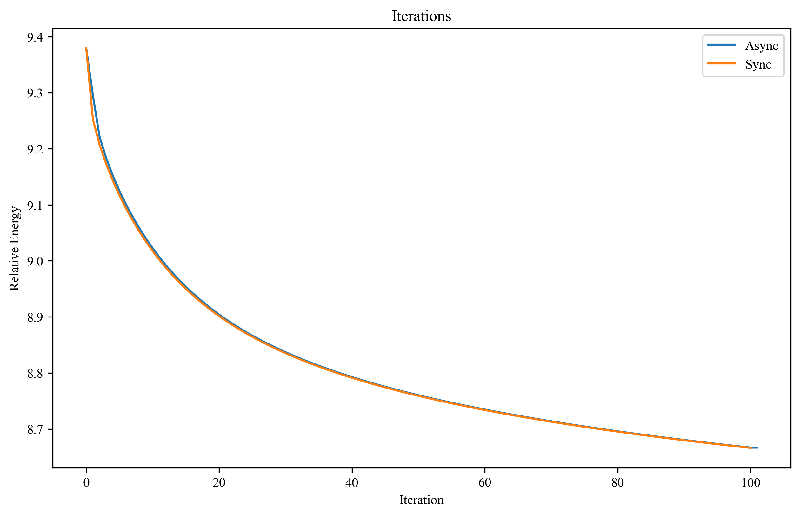

# HeteroScheduler

The source code of **SIGGRAPH 2025** paper **Auto Task Scheduling for Cloth and Deformable Simulation on Heterogeneous Environments** (Chengzhu He, Zhendong Wang, Zhaorui Meng, Junfeng Yao, Shihui Guo, Huamin Wang).

We provided several examples to show our scheduler and asynchronous iteration progress.

## Example 1: Simplist HEFT case

This example shows how HEFT algorithm makes scheduling.

Our HEFT implementation is based on [python-version heft](https://github.com/mackncheesiest/heft), which is the source code of paper on **IEEE Transactions on Parallel and Distributed Systems 2022**: "Performant, Multi-Objective Scheduling of Highly Interleaved Task Graphs on Heterogeneous System on Chip Devices" (J. Mack, S. E. Arda, U. Y. Ogras and A. Akoglu).

## Example 2: Asychronous iteration on VBD

This example shows the difference between the original iteration pipeline and our asynchronous iteration pileline. Considering we have allocated iteration tasks (different colors) into 2 devices, then how do we make data transfering? 

This example only considering the simplist case: costs of tasks is a constant value $t_c$ and the comminication delay is exactly the same value $t_c$, then we make make the data transfering as follows:

If we considering the overlapping across iterations (such as 10 iterations):

> Figures that visualizing the scheduling reult is generated by "documents/example2_scheduling_result.py".

We use mass-spring streching and quadratic bending model, this can also extended to other linear or non-linear energy model. VBD (Vertex Block Descent) is a SIGGRAPH 2024 paper. 

The convergent rate between sync-based simulation and async-based simulation is nearly the same (in some cases, async-based will convergent faster, especially considering collision energy). However, we will get about 90% speedup compared to single device implementation (From 10.30ms to 5.40ms):

> Figures that visualizing the convergence rate of async-based and sync-based simulation (in 100 iterations) is generated by "documents/example2_async_convergence.py".

## Example 3: Asychronous iteration with CPU-GPU implementation

This example shows how do we use our heterogenous framework in a simulation application. After we register the implementation and specify DAG, the our scheduler will automatically make scheuling including: calculating the communication matrix, allocating the tasks into devices, specifying the data tranfers, and update communication matrix each frame.

We use Metal-shading-language for GPU implementation, so this example is only supported on MacOS.

## Dependencies

The library itself depends only on glm and TBB. For windows users, TBB installed by vcpkg might be hard to debug, so we use the source code to compile. Example 3 can only run on MacOS due to our Metal based GPU implementation.